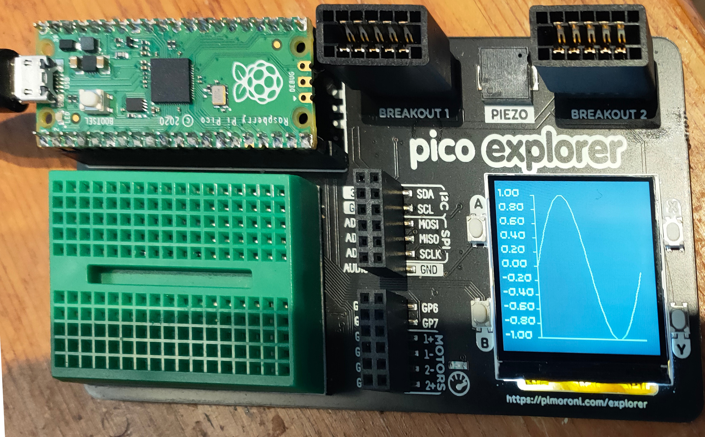

# microplot

## A simple MicroPython plotting package.

The current version runs on the Raspberry Pi Pico with the Pimoroni Pico Explorer base, the Adafruit Clue and 
Adafruit PyPortal.

It does Line plots amd Scatter plots at the moment.

Some code was copied from https://www.instructables.com/Raspberry-Pi-Pico-Pico-Explorer-Workout/
- Tony Goodhew's great introduction to the Pico Explorer.

The line drawing uses code from https://github.com/encukou/bresenham
Copyright © 2016 Petr Viktorin

## Installation

On all platforms, copy the Python files in `src/microplot/shared` to the device.

Then copy plotter.py from `src/micorplot/explorer` if you're using the Pomoroni explorer,
or from `src/microplot/adafruit` if you're using one f the Adafruit devices.

There are three demos you can run:
1. `demo.py` shows a single-line plot of a sine wave,
1. `demo_multi.py` shows a plot of multiple sine waves,
1. `scatter_demo.py` shows a scatter plot of some arbitrary data.

## Bitmap saving

There's [code to save bitmaps](src/microplot/explorer/bitmapsaver.py) from the Pico Explorer Base.

I'm currently struggling to get the code working with  CircuitPython.

