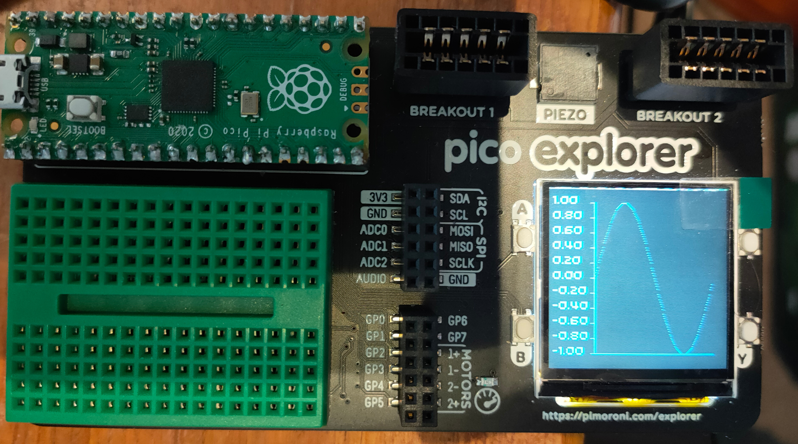

# microplot

## A (very) simple pure MicroPython plotting package.

The current version runs on the Raspberry Pi Pico with the Pimoroni Pico Explorer base.

It only does line plots in monochrome at the moment.

## Installation

You need to have the Pimoroni uf2 version 0.0.7 or later installed on your Pico.
Copy explorer.py and plots.py to your Pico using Thonny or ampy.

Open the repl and type:
```python
import math
from explorer import ExplorerPlotter
from plots import LinePlot

sines = list(math.sin(math.radians(x)) for x in range(0, 360, 4))

plot = LinePlot((sines),'MicroPlot line')
plot.plot(ExplorerPlotter())
```

