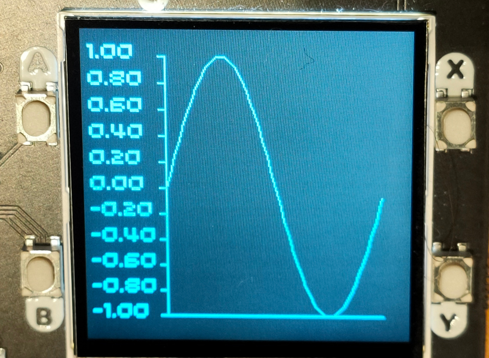

# Sample programs using MicroPlot

## The original version - a single time series plot.



ampy does not download binary files but you can copy the file to your computer using `pyboard`;

```shell
./pyboard.py -d /dev/ttyACM0 -f cp :graph.bmp graph.bmp
```

The plot was generated by the following code:

```python
import math
from plotter import Plotter
from plots import LinePlot

def run():
    sines = list(math.sin(math.radians(x))
                 for x in range(0, 361, 4))
    plot = LinePlot([sines],'MicroPlot line')
    plotter = Plotter()
    plot.plot(plotter)
```

Here's the monochrome bitmap file:


and here's the code to create and save it:

```python
import math
from plotter import Plotter
from plots import LinePlot


def run():
    sines = list(math.sin(math.radians(x))
                 for x in range(0, 361, 4))
    plot = LinePlot([sines],'MicroPlot line')
    plotter = Plotter()
    plot.plot(plotter)
    plotter.write_mono_bitmap('demo-mono.bmp')

run()
```

## Using the plotter to explore electronics

This experiment uses the plotter to illustrate the charging of a capacitor.

Here's the explorer set-up.


The output from GP0 is connected to one end of a 1K resistor. The other is connected to the positive side of 
a 4.7uF electrolytic capacitor, amd the common connection is used as an input to ADC0.

The negative side of the electrolytic capacitor is connected to  Ov (ground).

The code turns GP0 on and off every 50 milli-seconds, and the plot shows how the voltage across the capacitor varies.

The program is called `capvoltage.py`.

```python
from machine import Pin, ADC
from utime import sleep_us

from explorer import ExplorerPlotter
from plots import LinePlot


def capture_voltage(time_us=1000, samples=100):
    data = [0]*samples
    source = Pin(0, Pin.OUT)
    voltmeter = ADC(26)
    for i in range(samples):
        value = 1 if i < samples // 2 else 0
        source.value(value)
        data[i] = 3.3 * voltmeter.read_u16() / 65000.0
        sleep_us(time_us)
    return data


plot = LinePlot(capture_voltage(),'Cap charging')
plotter = ExplorerPlotter()
plot.plot(plotter)
```

